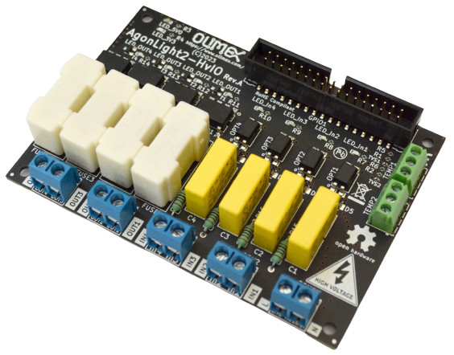

# AgonLight2-HvIO
High voltage optoisolated Four outputs and Four inputs and two Temperature sensor connectors for AgonLight2

https://www.olimex.com/Products/Retro-Computers/AgonLight2-HvIO/open-source-hardware

Features:

* AgonLight GPIO connector
* Four SSR relays 240VAC 1A
* Four optoisolated inputs 120-240VAC
* Two Dallas18B20 temperature sensors
* LED output indicators
* LED input indicators
* Power supply 3.3V and 5V LED indicators
* Dimensions 100x70mm

